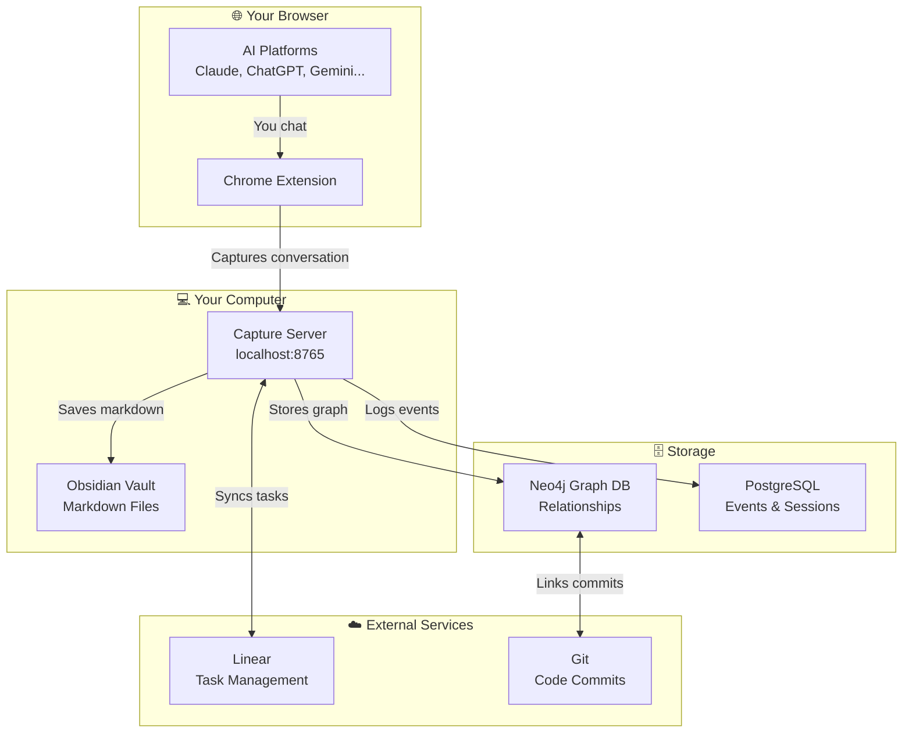
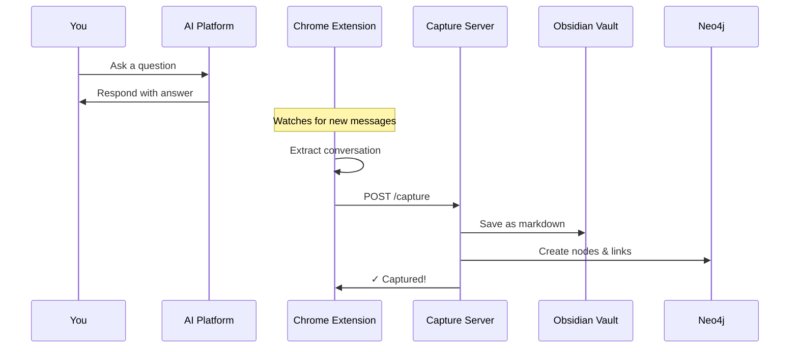
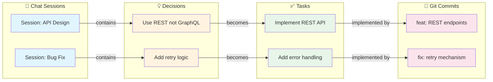
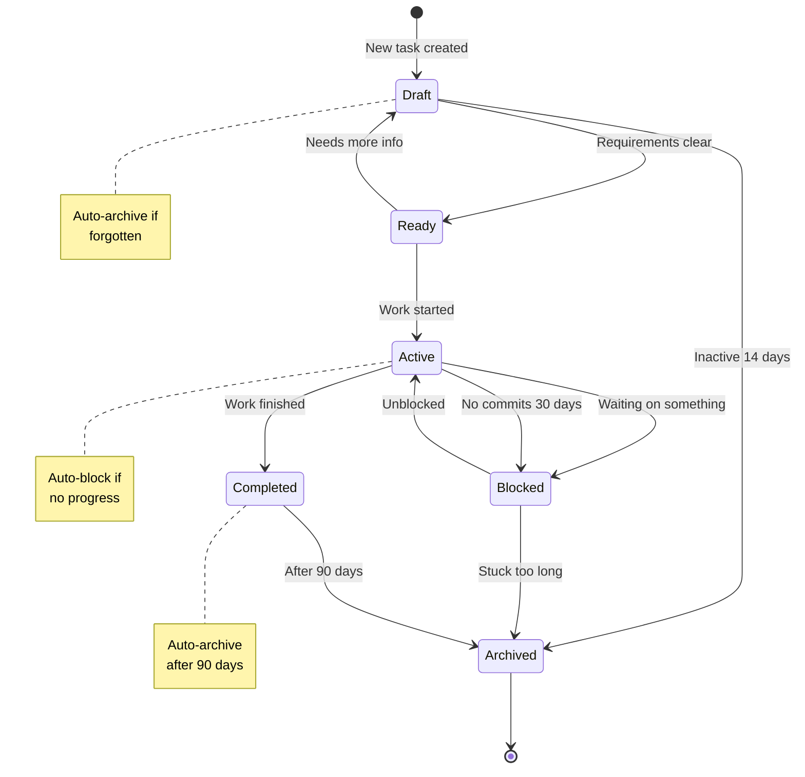
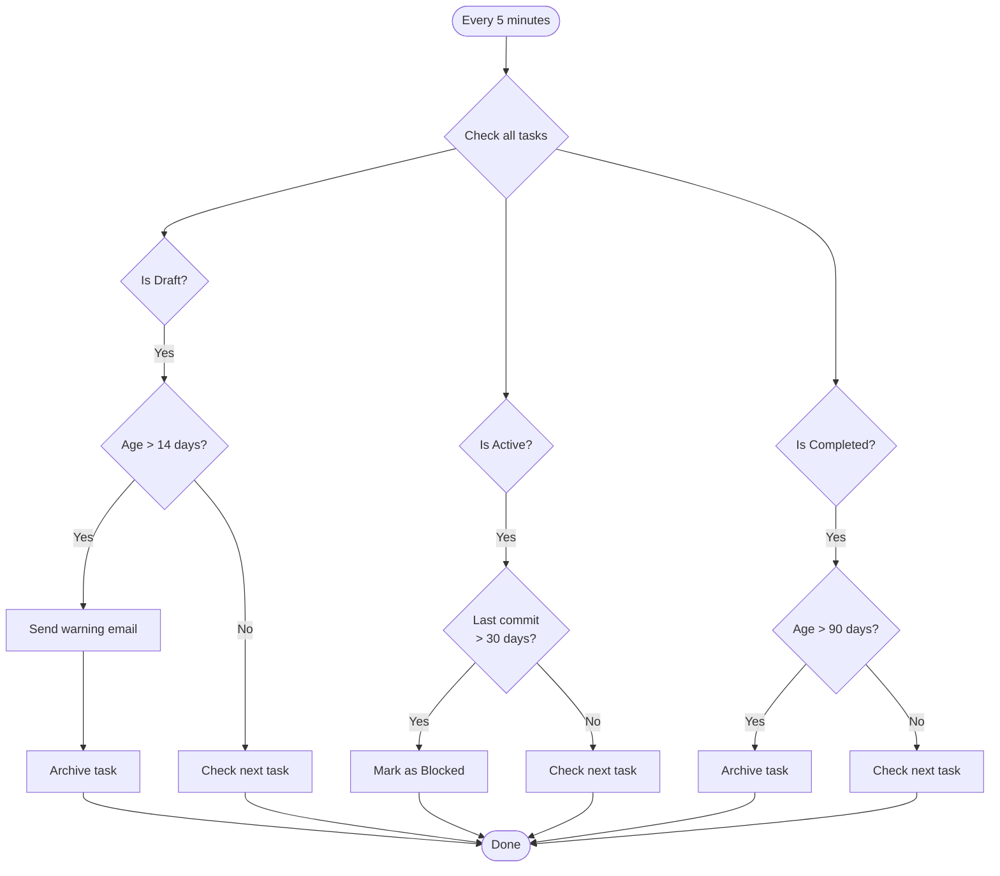

# Omega_KG

> **Your AI conversations are valuable. Stop losing them.**

## What is Omega_KG?

Ever had a brilliant conversation with ChatGPT, Claude, or Gemini — only to forget what you discussed a week later? Omega_KG solves this by automatically capturing your AI conversations and turning them into a searchable knowledge base.

**Think of it as a "second brain" that:**

- 🎯 **Captures** every AI conversation automatically (no copy-paste needed)
- 🔗 **Connects** ideas across different conversations and projects
- ✅ **Tracks** decisions that turn into tasks
- 📊 **Visualizes** how your ideas and work relate to each other

---

## How It Works (The Simple Version)

```
┌─────────────────┐     ┌─────────────────┐     ┌─────────────────┐
│  You chat with  │     │   Omega_KG      │     │  Your personal  │
│  ChatGPT/Claude │ ──▶ │   captures it   │ ──▶ │  knowledge base │
│  /Gemini/etc    │     │   automatically │     │  (searchable!)  │
└─────────────────┘     └─────────────────┘     └─────────────────┘
```

**That's it.** A Chrome extension watches your AI conversations, saves them to your computer, and organizes them so you can find anything later.

---

## Architecture Overview

### System Components



### Data Flow: From Chat to Knowledge



### The Knowledge Graph: How Ideas Connect



---

## Task Lifecycle: From Idea to Done

Tasks don't just sit there — they move through stages automatically:



**What this means:**

- 📝 **Draft** → You captured an idea but haven't fleshed it out
- ✅ **Ready** → Clear enough to start working on
- 🔨 **Active** → You're currently working on it
- 🚧 **Blocked** → Waiting for something (auto-detected if no commits)
- ✓ **Completed** → Done!
- 📦 **Archived** → Out of sight, but searchable

---

## Decision Logic: When Things Happen Automatically



---

## Supported AI Platforms

| Platform | Status | Auto-Capture |
|----------|--------|--------------|
| ChatGPT | ✅ Supported | Yes |
| Claude | ✅ Supported | Yes |
| Gemini | ✅ Supported | Yes |
| Perplexity | ✅ Supported | Yes |
| DeepSeek | ✅ Supported | Yes |
| Mistral | ✅ Supported | Yes |
| AI Studio | ✅ Supported | Yes |
| Qwen | ✅ Supported | Yes |

---

## Quick Start

### What You Need

- **Python 3.12+** — The programming language
- **Poetry** — Manages Python packages
- **Neo4j** — Graph database (free desktop version works)
- **Chrome/Edge** — For the browser extension

### 5-Minute Setup

```bash
# 1. Get the code
git clone https://github.com/ApexSigma-Solutions/omega_kg.git
cd omega_kg

# 2. Install dependencies
poetry install --with dev

# 3. Create your config file
cp .env.example .env
# Edit .env with your passwords and paths

# 4. Start the server
poetry run capture-server
# Server runs at http://localhost:8765
```

### Install the Chrome Extension

1. Open `chrome://extensions` in Chrome
2. Enable **Developer mode** (top right)
3. Click **Load unpacked**
4. Select the `chrome-extension/` folder
5. Click the extension icon → Enter your API key

**Done!** Start chatting with any AI platform and watch conversations appear in your vault.

---

## Port Reference

| Service | Port | Purpose |
|---------|------|---------|
| Capture Server | 8765 | Receives conversations from extension |
| Neo4j Browser | 7474 | Graph visualization UI |
| Neo4j Bolt | 7687 | Database connections |
| PostgreSQL | 5433 | Event storage |
| Ollama | 11434 | Local AI embeddings |

See [docs/PORT_MAPPING.md](./docs/PORT_MAPPING.md) for detailed configuration.

---

## Project Structure

```
omega_kg/
├── capture_server.py   # Receives conversations from browser
├── lifecycle.py        # Manages task states automatically
├── linear_sync.py      # Syncs with Linear task manager
├── percolation.py      # Extracts insights into graph
├── settings.py         # Configuration management
│
├── chrome-extension/   # Browser extension files
│   ├── background.js   # Handles communication
│   ├── content.js      # Extracts conversations
│   └── config.js       # Extension settings
│
└── docs/               # Documentation
    └── PORT_MAPPING.md # Network configuration
```

---

## Common Commands

```bash
# Start the capture server
poetry run capture-server

# Run lifecycle checks (preview mode)
poetry run python -m omega_kg.lifecycle --dry-run

# Run tests
poetry run pytest

# Check code quality
poetry run ruff check .
```

---

## Configuration

Create a `.env` file from the template:

```bash
cp .env.example .env
```

Key settings to configure:

```env
# Where to save conversations
OBSIDIAN_VAULT_PATH=D:\your\vault\path

# Neo4j database
NEO4J_URI=bolt://localhost:7687
NEO4J_PASSWORD=your-password

# Server port (default 8765)
APP_PORT=8765
```

---

## Troubleshooting

### "Package not installed" Error

If you encounter "Package not installed" errors, see the [Installation Troubleshooting Guide](docs/INSTALLATION_TROUBLESHOOTING.md) for detailed resolution steps.

### Extension says "Failed to fetch"

→ Is the capture server running? Check `http://localhost:8765/health`

### Conversations not appearing

→ Reload the extension in `chrome://extensions`

### Neo4j connection failed

→ Make sure Neo4j Desktop is running

---

## Contributing

1. Fork the repository
2. Create a feature branch: `git checkout -b feature/my-feature`
3. Make changes and test: `poetry run pytest`
4. Submit a pull request

See [SECURITY.md](./SECURITY.md) for security best practices and vulnerability reporting.

---

## Security

We take security seriously. Please review our [Security Policy](./SECURITY.md) for:

- Reporting security vulnerabilities
- Security best practices
- Secret management guidelines
- Pre-commit security hooks

**Never commit private keys, API keys, or credentials to the repository.**

---

## License

MIT License — see [LICENSE](./LICENSE) for details.

---

## Links

- 📖 [Full Documentation](./docs/index.md)
- 🐛 [Report Issues](https://github.com/ApexSigma-Solutions/omega_kg/issues)
- 🔒 [Security Policy](./SECURITY.md)
- 📋 [API Reference](./docs/reference.md)
- 🌐 [Port Configuration](./docs/PORT_MAPPING.md)
