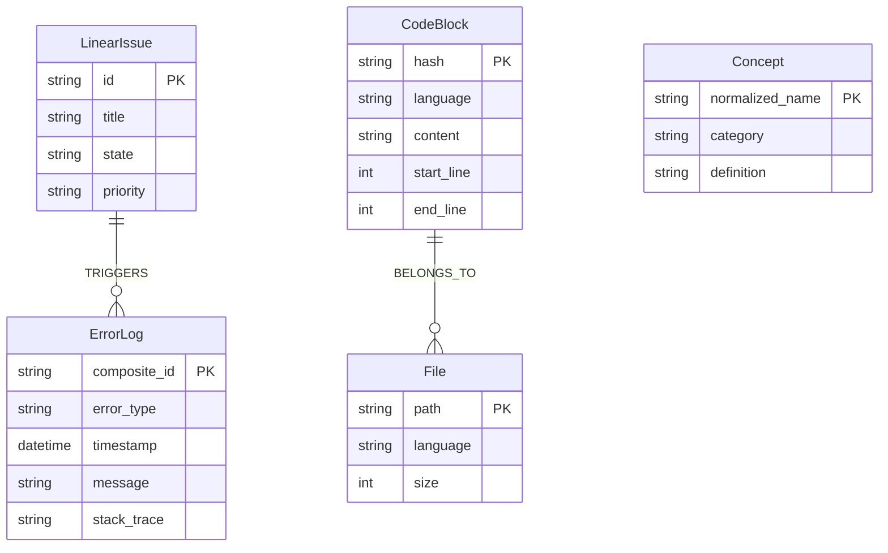
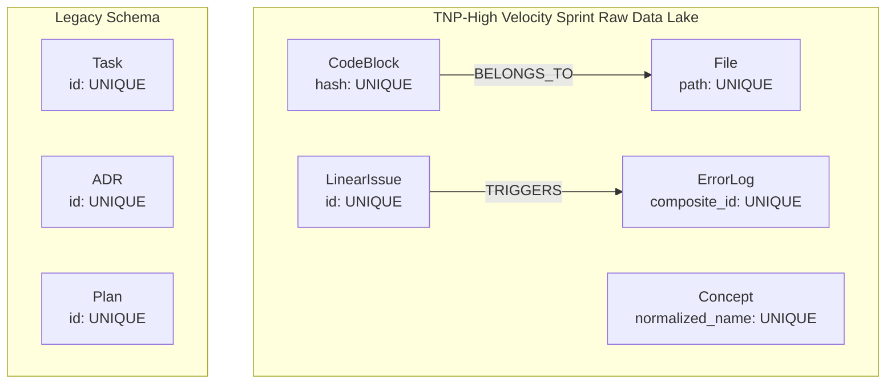

# TNP-High Velocity Sprint Raw Data Lake Schema

## Node Types

| Node | Constraint | Properties |
|------|------------|------------|
| `CodeBlock` | `codeblock_hash` UNIQUE | hash, language, content, start_line, end_line |
| `ErrorLog` | `errorlog_composite` UNIQUE | composite_id, error_type, timestamp, message, stack_trace |
| `Concept` | `concept_name` UNIQUE | normalized_name, category, definition |
| `File` | `file_path` UNIQUE | path, language, size |
| `LinearIssue` | `linearissue_id` UNIQUE | id, title, state, priority |

## Relationships

## Full Schema Graph

## Constraints Summary

### New TNP-High Velocity Sprint Constraints
| Constraint Name | Type | Node | Properties |
|----------------|------|------|------------|
| `codeblock_hash` | UNIQUENESS | CodeBlock | hash |
| `errorlog_composite` | UNIQUENESS | ErrorLog | composite_id |
| `concept_name` | UNIQUENESS | Concept | normalized_name |
| `file_path` | UNIQUENESS | File | path |
| `linearissue_id` | UNIQUENESS | LinearIssue | id |

### Indexes for Query Performance
| Index Name | Node | Properties |
|------------|------|------------|
| `errorlog_type` | ErrorLog | error_type |
| `errorlog_timestamp` | ErrorLog | timestamp |
| `concept_category` | Concept | category |
| `codeblock_language` | CodeBlock | language |

## Application Notes

1. **ErrorLog composite_id**: Must be generated as `error_type + "||" + timestamp` for uniqueness
2. **Concept normalized_name**: Must be lowercase, trimmed, and whitespace-normalized
3. **Relationship types**: TRIGGERS and BELONGS_TO are defined but require nodes to exist first
4. **Neo4j Community Edition limitation**: NODE KEY constraints not supported; using composite_id workaround
